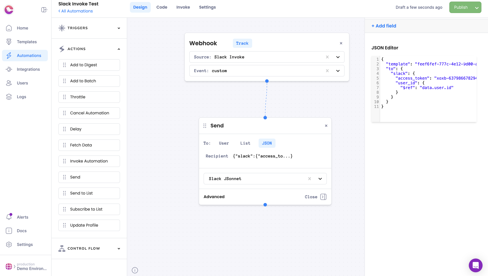

Work in progress!
Known issues:
- Courier Click/Interaction tracking
- Data from first Courier send, missing in interactive updates


```bash
yarn install
yarn dev
```

1. Create Slack App
1. Set up Courier > Slack
1. In Slack App, set up Interactivity Request URL to point to this app (use ngrok if running locally)
1. `cp .env.example .env` and fill in values, then `yarn dev`
1. Create a Slack Template in Courier that has interactivity (button or select)
1. Change the Slack Channel settings for a replacement key of data.message.ts
1. Send a test message
1. Interact with it
1. Data should flow through the middleware
1. Create an automation that sends to the same JSON template.

